<p align="center"><a href="https://laravel.com" target="_blank"></a></p>

<p align="center">
<a href="https://github.com/laravel/framework/actions"></a>
<a href="https://packagist.org/packages/laravel/framework"></a>
<a href="https://packagist.org/packages/laravel/framework"></a>
<a href="https://packagist.org/packages/laravel/framework"></a>
</p>

# 📚 Statmastery

Statmastery is a comprehensive web-based learning platform designed to enhance the way students and educators connect in the field of mathematics and statistics. It offers an intuitive and flexible system for both self-paced learning and personalized instruction.

## 🔑 Key Features:

-   **Course Management Module**: Students can browse, enroll in, and access a variety of online math-related courses.

-   **Instructor Booking System**: Users can view instructor profiles, check available time slots, and schedule one-on-one learning sessions.

-   **Google Calendar Integration**: Automatically sync booked sessions with learners' and instructors' Google Calendars for seamless scheduling and reminders.

-   **Rich Text Editor (TinyMCE)**: Instructors can easily create and format engaging course content using a powerful and user-friendly editor.

-   **Admin Dashboard**: Robust tools for managing users, courses, instructors, and bookings, giving full control to system administrators.

-   **User-Centric Design**: Includes secure login, automated email notifications, and a built-in feedback system to enhance the user experience.

Statmastery bridges the gap between structured learning and personalized education, creating a more dynamic, accessible, and engaging way to master mathematical concepts.

<br>

---

# ⚙️ Installation & Setup Guide (Laravel + XAMPP)

Follow these steps to install and set up **Statmastery** locally using Laravel and XAMPP:

### 🧰 Requirements

-   PHP >= 8.1
-   Composer
-   XAMPP (MySQL & Apache)
-   Node.js and NPM (for frontend assets, if applicable)

---

### 📦 1. Clone the Repository

```bash
git clone https://github.com/FiereEinar/statmastery.git
cd statmastery
```

---

### ⚙️ 2. Set Up `.env` File

Create a `.env` file from the example template:

```bash
cp .env.example .env
```

Open `.env` and fill in the required values, required values have "<REQUIRED>" value in `.env.example`.

---

### 🗃️ 3. Create the Database

-   Open **phpMyAdmin** via XAMPP.
-   Create a new MySQL database with the name you specified in `DB_DATABASE`.

---

### 📥 4. Install Dependencies

```bash
composer install
npm install && npm run dev
```

---

### 🔑 5. Generate Application Key

```bash
php artisan key:generate
```

---

### 🧪 6. Run Migrations & Seeders (Optional)

```bash
php artisan migrate --seed
```

---

### 🚀 7. Serve the Application

Start your Laravel development server:

```bash
php artisan serve
```

Open your browser and navigate to:
[http://localhost:8000](http://localhost:8000)

Or, if you're using a virtual host via XAMPP, use the custom URL you configured.

---

### 🛠️ 8. XAMPP Notes

-   Ensure **Apache** and **MySQL** are running via the XAMPP Control Panel.
-   If port `8000` is already in use, specify a different port:

    ```bash
    php artisan serve --port=8080
    ```

---

# 📸 Screenshots

A visual tour of the platform's features and user interface:

### 🏠 Landing Page

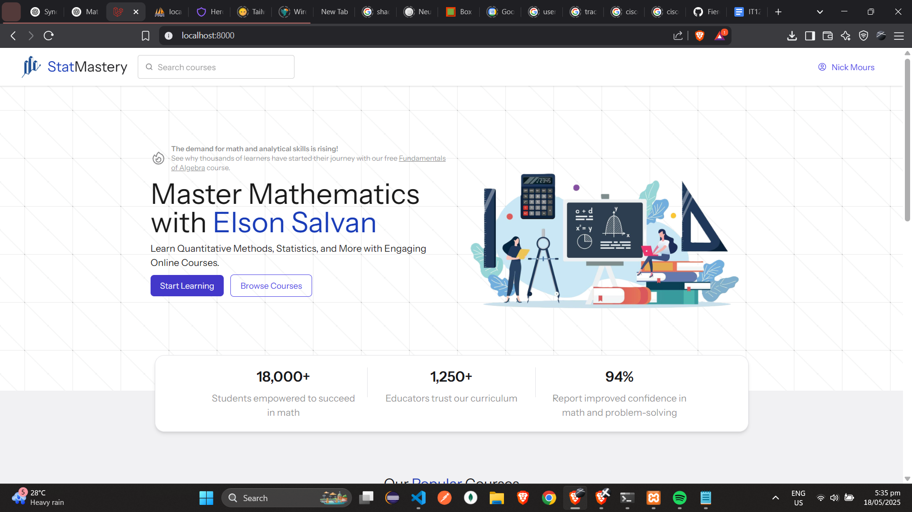

### 🎓 Browse Courses

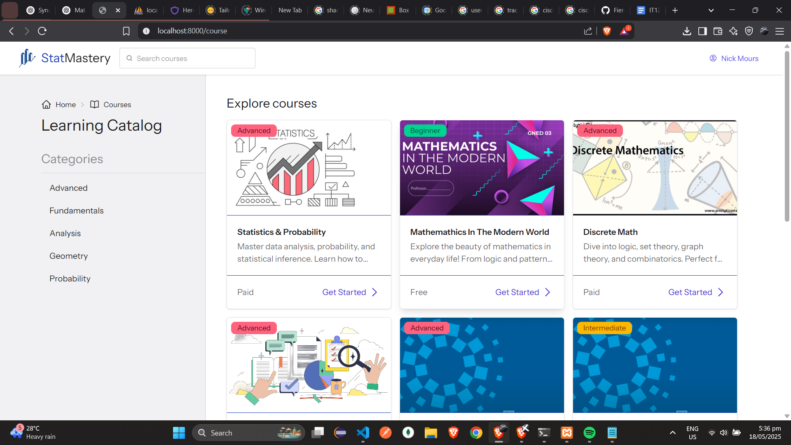

### 📖 View Course

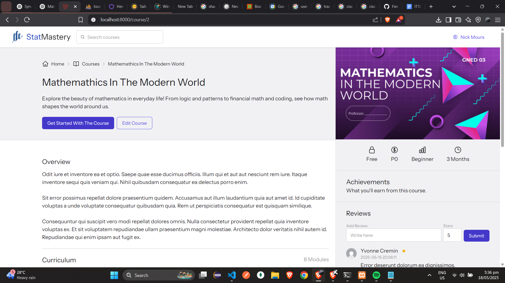

### 🧑‍🏫 Take Course

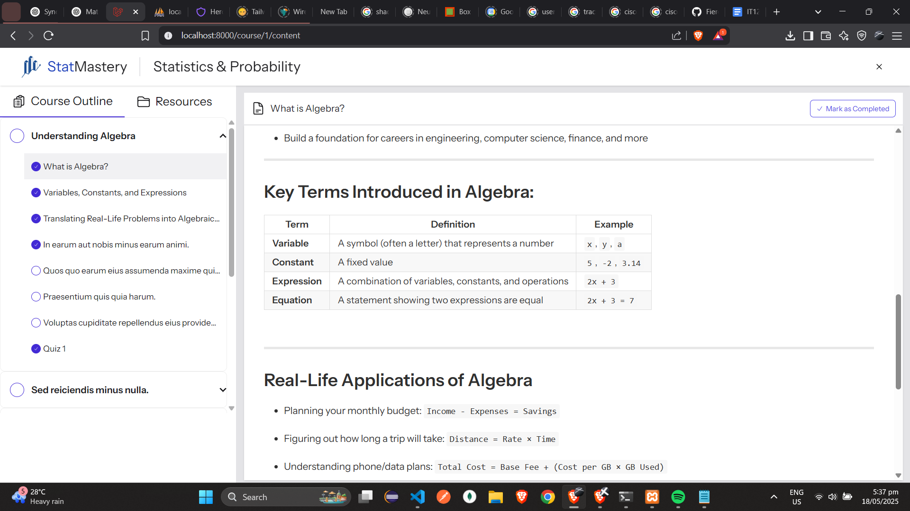

### 🛠️ Create Course

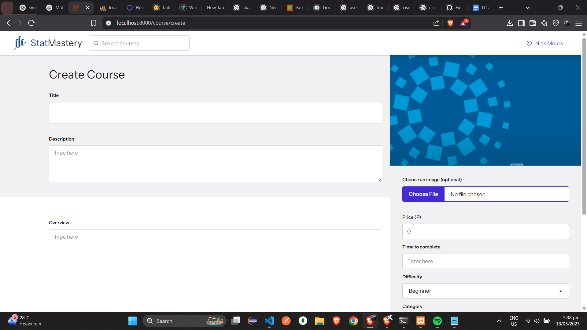

### 📝 Edit Course

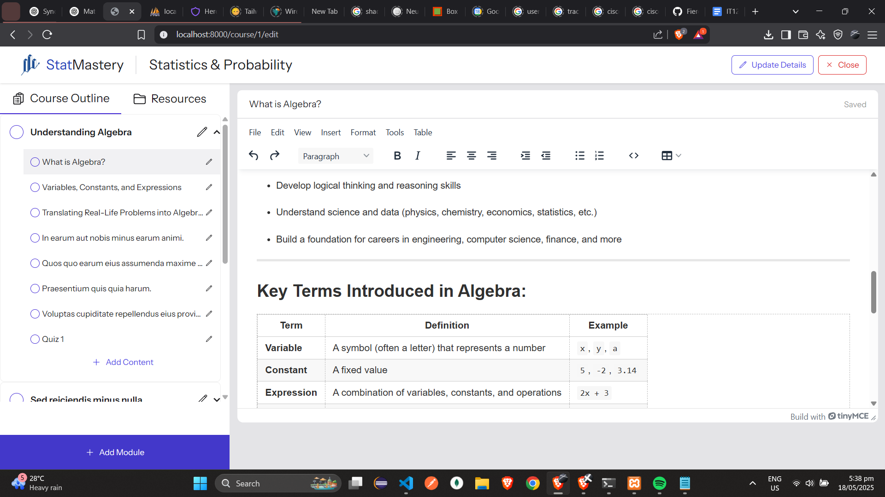

### 📚 Manage Course

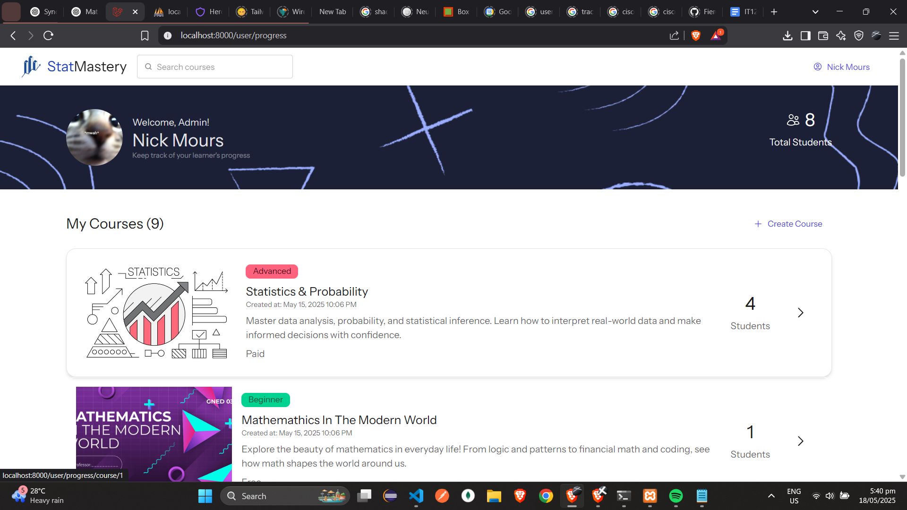

### 🧮 Course Quizzes

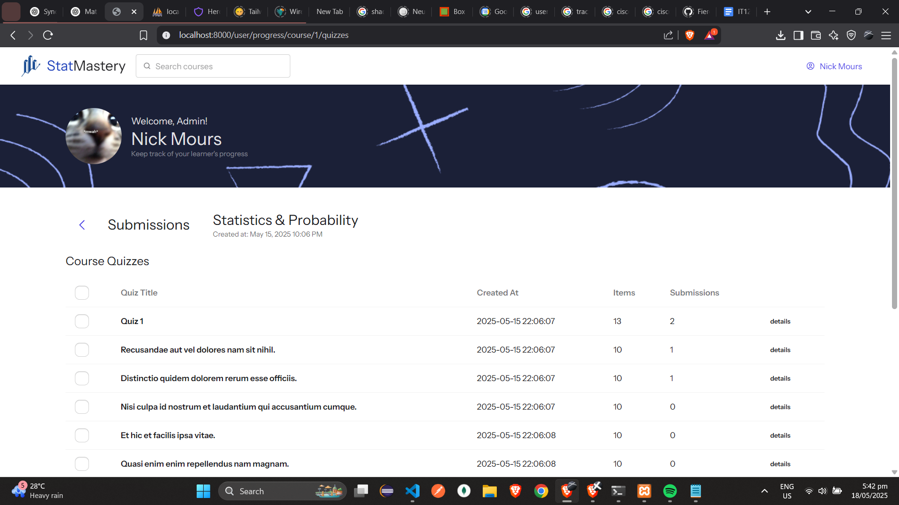

### 📋 Learner Submissions (Quiz)

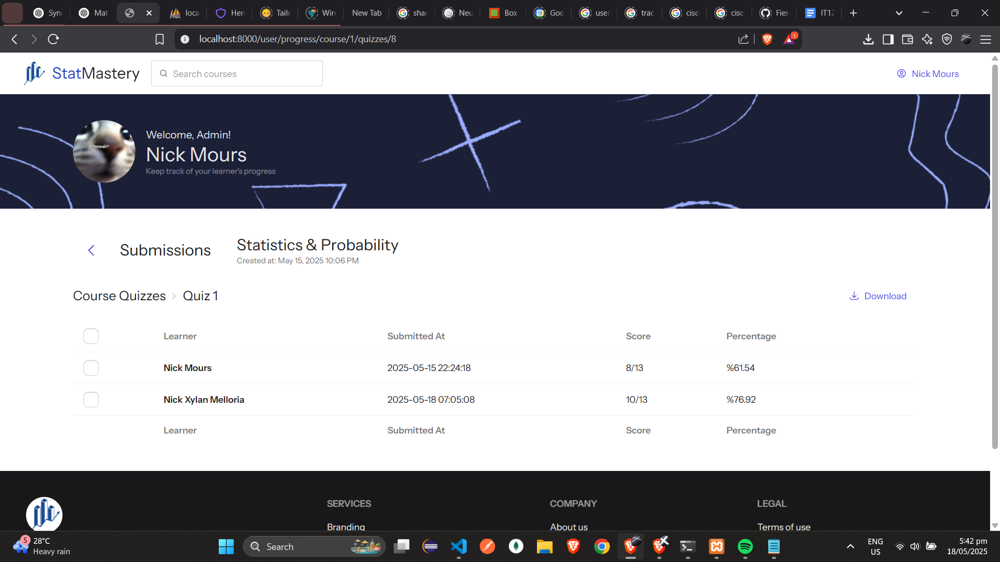

### 📩 Learner Submissions (Course)

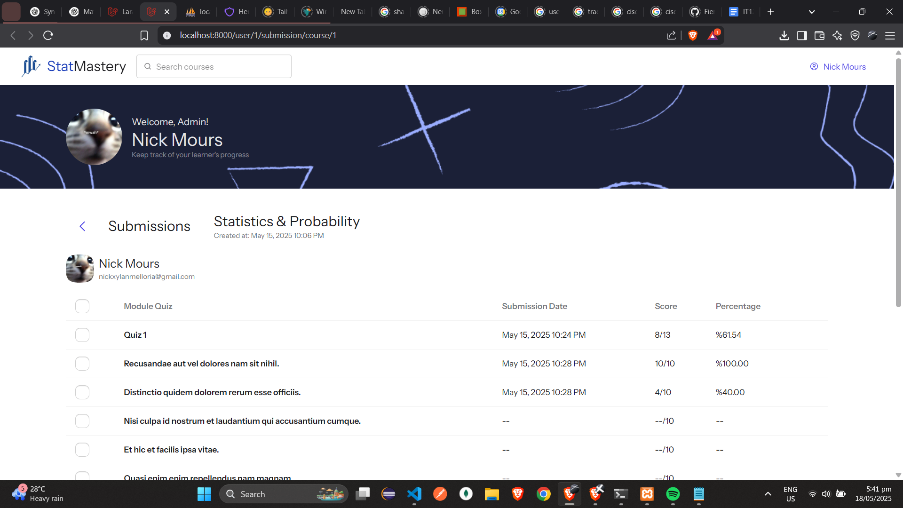

### 👨‍🎓 Course Learners

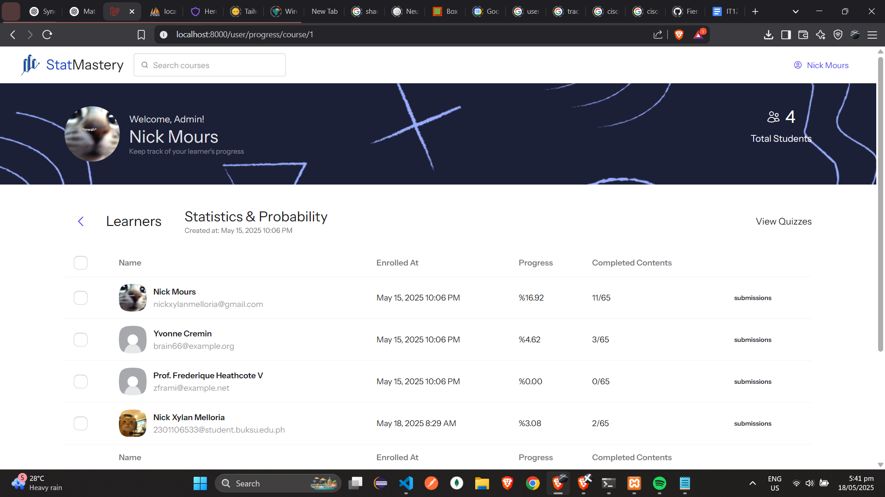

### 📅 Create Booking

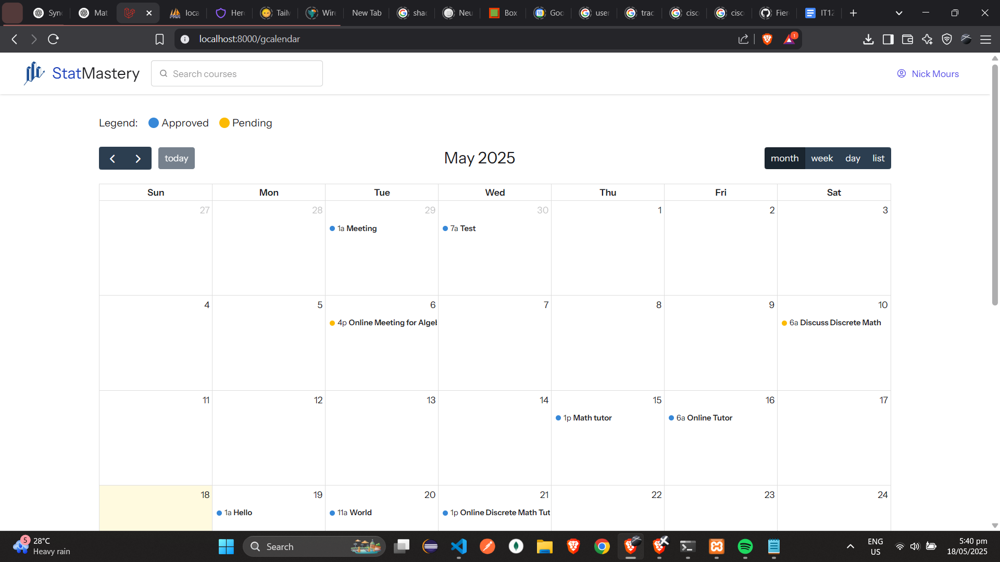

### 📆 Manage Bookings

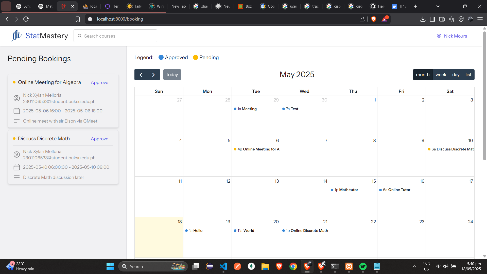

### 👤
