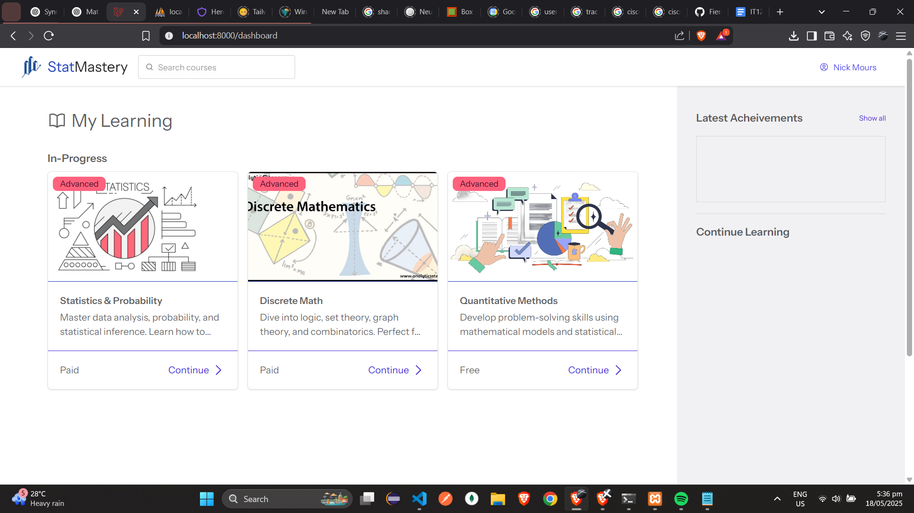
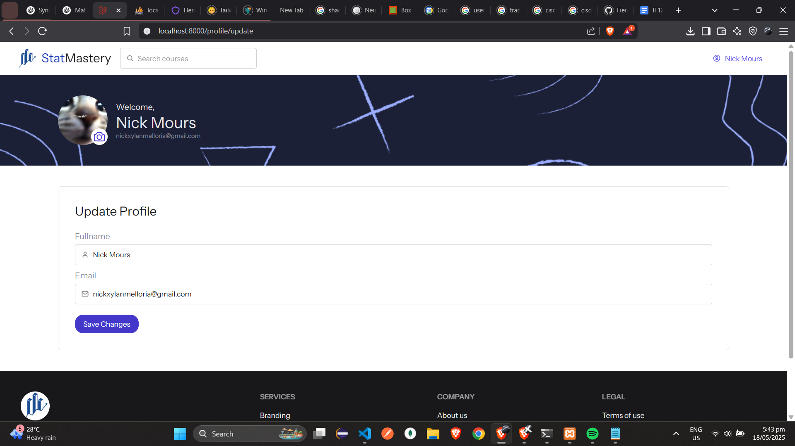

# 📚 Statmastery

Statmastery is a comprehensive web-based learning platform designed to enhance the way students and educators connect in the field of mathematics and statistics. It offers an intuitive and flexible system for both self-paced learning and personalized instruction.

## 🚀 Key Features

-   **👨‍🏫 Course Management (CRUD)**  
    Instructors can create, update, and delete detailed course content, including descriptions, media, and resources.

-   **🔐 Authentication & Authorization**  
    Role-based access system to separate admins, instructors, and learners with secure login.

-   **💳 Payment Integration (PayMongo)**  
    Accept payments for premium courses with seamless PayMongo integration.

-   **🧑‍🎓 User Profile Management**  
    Learners and instructors can manage their personal and professional information.

-   **📝 Rich Text Editor (TinyMCE)**  
    Compose engaging and well-formatted lessons and instructions using a rich text editor.

-   **📁 Upload & Download Course Resources**  
    Instructors can upload PDFs, images, and files; learners can download them anytime.

-   **📊 Quizzes for Courses**  
    Add assessments to any module to track student learning and understanding.

-   **📥 Import Quizzes via CSV**  
    Bulk import quizzes through CSV files for faster content creation.

-   **📈 Quiz Submission Reports**  
    Track learner progress and quiz performance via detailed reports.

-   **💬 Course Comments & Reviews**  
    Learners can provide feedback and rate courses to help others choose wisely.

-   **🗂️ Manage Course Categories**  
    Organize courses into categories for easy browsing and discovery.

-   **🗓️ Booking System with Google Calendar Integration**  
    Instructors can list their availability, and learners can book sessions that sync directly with Google Calendar.

-   **📚 Browse and Enroll in Courses**  
    Users can explore free and paid courses and enroll with a click.

Statmastery bridges the gap between structured learning and personalized education, creating a more dynamic, accessible, and engaging way to master mathematical concepts.

<br>

---

# ⚙️ Installation & Setup Guide (Laravel + XAMPP)

Follow these steps to install and set up **Statmastery** locally using Laravel and XAMPP:

### 🧰 Requirements

-   PHP >= 8.1
-   Composer
-   XAMPP (MySQL & Apache)
-   Node.js and NPM (for frontend assets, if applicable)

---

### 📦 1. Clone the Repository

```bash
git clone https://github.com/FiereEinar/statmastery.git
cd statmastery
```

---

### ⚙️ 2. Set Up `.env` File

Create a `.env` file from the example template:

```bash
cp .env.example .env
```

Open `.env` and fill in the required values, required values have "REQUIRED" value in `.env.example`.

---

### 🗃️ 3. Create the Database

-   Open **phpMyAdmin** via XAMPP.
-   Create a new MySQL database with the name you specified in `DB_DATABASE`.

---

### 📥 4. Install Dependencies

```bash
composer install
npm install && npm run dev
```

---

### 🔑 5. Generate Application Key

```bash
php artisan key:generate
```

---

### 🧪 6. Run Migrations & Seeders

```bash
php artisan migrate --seed
```

---

### 🚀 7. Serve the Application

Start your Laravel development server:

```bash
php artisan serve
```

Open your browser and navigate to:
[http://localhost:8000](http://localhost:8000)

Or, if you're using a virtual host via XAMPP, use the custom URL you configured.

---

### 🛠️ 8. XAMPP Notes

-   Ensure **Apache** and **MySQL** are running via the XAMPP Control Panel.
-   If port `8000` is already in use, specify a different port:

    ```bash
    php artisan serve --port=8080
    ```

---

# 📸 Screenshots

A visual tour of the platform's features and user interface:

### 🏠 Landing Page


### 🎓 Browse Courses


### 📖 View Course


### 🧑‍🏫 Take Course


### 🛠️ Create Course


### 📝 Edit Course


### 📚 Manage Course


### 🧮 Course Quizzes


### 📋 Learner Submissions (Quiz)


### 📩 Learner Submissions (Course)


### 👨‍🎓 Course Learners


### 📅 Create Booking


### 📆 Manage Bookings


### 👤 Learner Dashboard



### ⚙️ Update Profile


